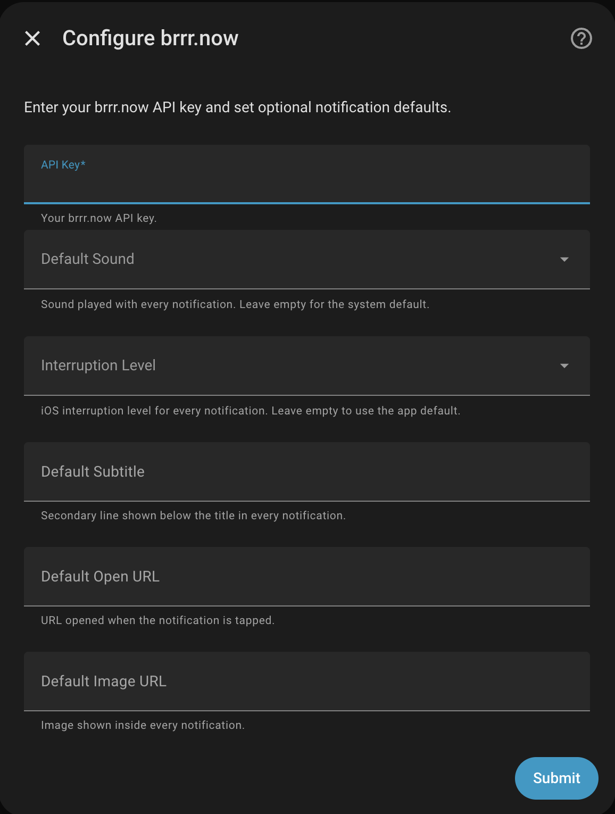

# Installation

## Via HACS (recommended)

1. In HACS, go to **Integrations** → click the three-dot menu → **Custom repositories**
2. Add this repository URL and select category **Integration**
3. Click **Download** on the brrr integration
4. Restart Home Assistant
5. Go to **Settings → Integrations → Add Integration** and search for **brrr**

## Manual

Copy the `custom_components/brrr/` folder into your HA `config/custom_components/` directory, restart HA, then go to **Settings → Integrations → Add Integration → search "brrr"**.

# Configuration

After adding the integration, you need to add a new entity. Here you can add all the confguration. 

Set these when adding the integration (**Settings → Devices & Services → Add Integration → brrr**). They apply to every notification sent by this integration instance.



## Parameter overview

| Field | Description |
|---|---|
| **API Key** *(required)* | Your brrr.now API key |
| **Default Sound** | Sound played with every notification — see valid values below |
| **Interruption Level** | iOS interruption level: `passive`, `active`, `time-sensitive`, `critical` |
| **Default Subtitle** | Secondary line shown below the title |
| **Default Open URL** | URL opened when the notification is tapped |
| **Default Image URL** | Image shown inside the notification |

### Valid sounds

```
default           system            brrr              bell_ringing
bubble_ding       bubbly_success_ding  cat_meow        calm1
calm2             cha_ching         dog_barking       door_bell
duck_quack        short_triple_blink   upbeat_bells    warm_soft_error
```

> **Note:** Using an invalid sound value will log an error and abort the notification without sending it.
