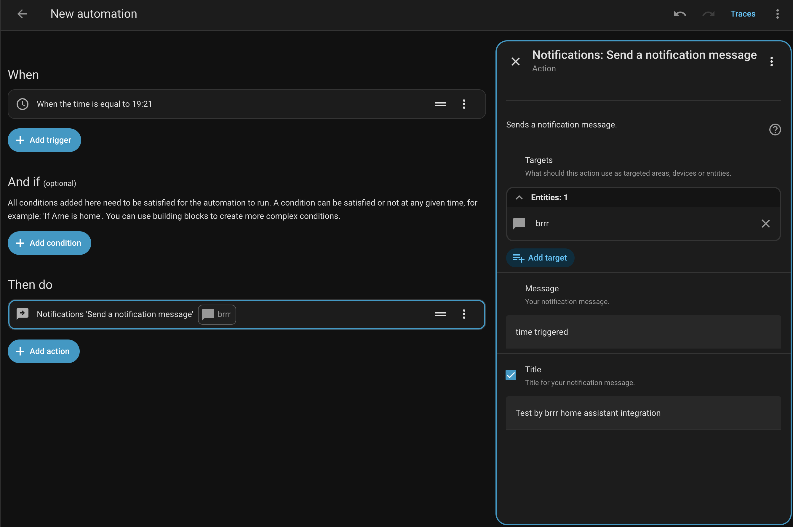
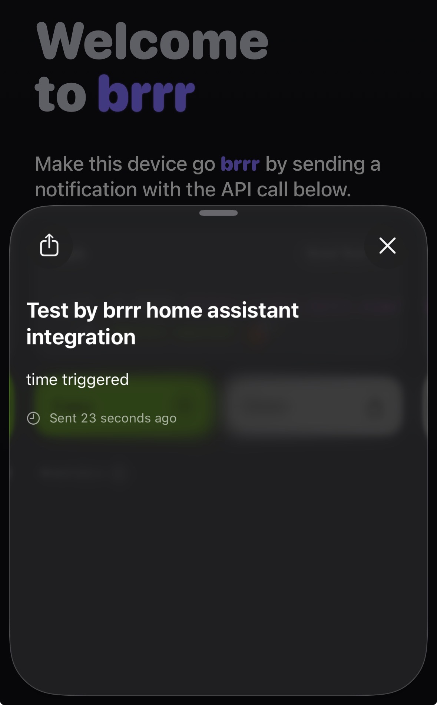

# Usage

In an automation, just provide the message and an optional title:

```yaml
action: notify.send_message
target:
  entity_id: notify.brrr
data:
  message: "Hello from HA"
  title: "My Title"
```

# Creating an Automation with a Time Condition

This guide walks you through creating an automation that fires at a specific time and sends a brrr notification, including optional fields like sound.

## Via the Home Assistant UI

1. Go to **Settings → Automations & Scenes → Automations** and click **+ Create Automation**
2. Click **Create new automation** to open the visual editor

### Step 1 — Add a Time trigger

1. Under **Triggers**, click **Add Trigger** → select **Time**
2. Set **At** to the time you want, e.g. `07:30:00`

This fires the automation every day at that exact time. For a one-shot trigger on a specific date, use a **Time and Date** (`datetime`) helper instead (see the YAML example below).

### Step 2 — (Optional) Add a Time condition

Conditions let you restrict the automation to certain days or a time window. To limit it to weekdays only:

1. Under **Conditions**, click **Add Condition** → select **Time**
2. Enable **Weekday** and tick **Mon – Fri**

### Step 3 — Add the brrr notification action

1. Under **Actions**, click **Add Action** → select **Perform action**
2. In the action search box type `notify.send_message` and select it
3. In the **Target** field, pick the entity **brrr**
4. Fill in **Message** and optionally **Title**

```yaml
action: notify.send_message
target:
  entity_id: notify.brrr
data:
  message: "Good morning! Time to start your day."
  title: "Morning Reminder"
```

Sound, interruption level, and other defaults will be applied automatically from the integration configuration.

5. Click **Save**.



### Full YAML example

Paste this into **Settings → Automations → ⋮ → Edit as YAML** (or into your `automations.yaml`):

```yaml
alias: "Morning brrr notification"
description: "Send a brrr push notification every weekday at 7:30 AM"

trigger:
  - platform: time
    at: "07:30:00"

condition:
  - condition: time
    weekday:
      - mon
      - tue
      - wed
      - thu
      - fri

action:
  - action: notify.send_message
    target:
      entity_id: notify.brrr
    data:
      message: "Good morning! Time to start your day."
      title: "Morning Reminder"

mode: single
```

# Notification

At the brrr app, this notification will be displayed like this:


